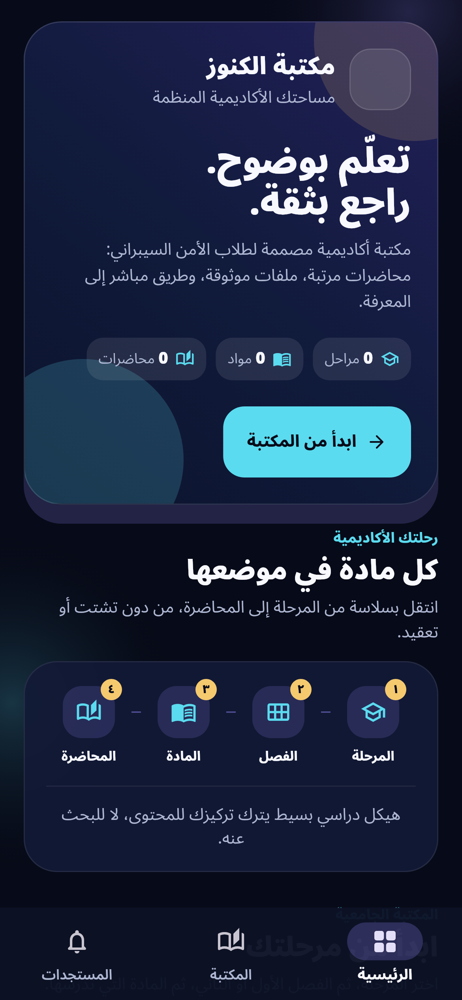

# CyKun Reader

> **The official Android Reader for CyKun — Cyber Kunooze / سايبر الكنوز.**

CyKun is an Arabic, right-to-left student reader for university cybersecurity material. It gives students one calm route through the academic library: **Stage → Semester → Subject → Numbered lecture**.

The public repository contains the **single official CyKun v1.0.0 Reader release** and the documentation needed to verify and install it. It does not contain source code, publisher credentials, signing keys, Firebase configuration, unpublished materials, or student records.

## Download the only release

| Item | Link |
| :--- | :--- |
| **CyKun Reader v1.0.0 APK** | [Download the official APK](https://github.com/9gkc/cykun/releases/download/v1.0.0/cykun-reader-v1.0.0.apk) |
| **Release page** | [Open CyKun v1.0.0](https://github.com/9gkc/cykun/releases/tag/v1.0.0) |
| **Installation guide** | [Install or update CyKun](docs/INSTALLATION.md) |
| **Verification record** | [Verify the APK](docs/VERIFICATION.md) |

The official package is `cykun-reader-v1.0.0.apk`. Its SHA-256 fingerprint is:

```text
df24f9196e2b7c31f42b798ad44a8abf649ad3906a0b379035d600d29fcc0b87
```

## A first look at CyKun

These are interface previews from the CyKun Reader design. They are included to help students understand the experience before installation. The counters shown in the previews may be empty when no library material is currently published; they are not a claim about the live catalogue.

<p align="center">
  
  
  
</p>

## What students can do

CyKun is designed for reading and navigating approved material, not for managing the publisher’s content. Students can browse academic stages, select a semester, open a subject, follow numbered lectures, read published text lessons, open owner-approved PDF resources, and view active announcements or timetable notices.

The app does not require a student account for browsing published material. The Community destination links to the official [CyS4Ever Telegram channel](https://t.me/cys4ever) and [Ali Alkarar on LinkedIn](https://www.linkedin.com/in/9gkc/).

## Install safely

1. Download the APK only from the official [v1.0.0 release page](https://github.com/9gkc/cykun/releases/tag/v1.0.0).
2. Compare its SHA-256 value with the fingerprint in [VERIFICATION.md](docs/VERIFICATION.md).
3. Install the APK on Android and open **CyKun**.
4. If Android requests permission to install from the download source, allow only the trusted browser or file manager you used.

For complete steps, read the [installation guide](docs/INSTALLATION.md).

## Public distribution boundary

| Included | Not included |
| :--- | :--- |
| One signed Reader APK: v1.0.0 | Publisher application |
| Installation and verification documentation | Source code |
| Curated interface previews | Signing keys and credentials |
| Public community links | Firebase configuration and student records |

> Security-sensitive material must never be committed to this repository. If you discover a security issue, contact the maintainer privately through [Ali Alkarar’s LinkedIn](https://www.linkedin.com/in/9gkc/) rather than publishing credentials or private data in an issue.

## Maintainer

**Ali Alkarar** · [@9gkc](https://github.com/9gkc) · [LinkedIn](https://www.linkedin.com/in/9gkc/)

## License and scope

This repository is a public distribution and documentation surface for the CyKun Reader. The APK is provided for students through the official release page. Redistribution must preserve the original file and verification information.
