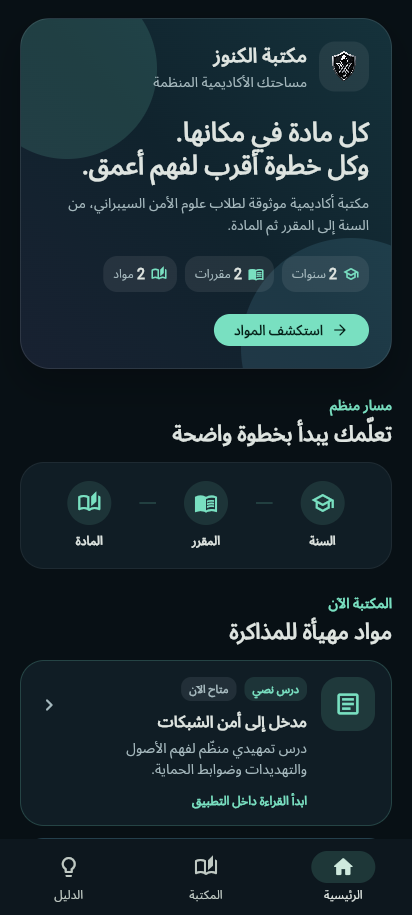
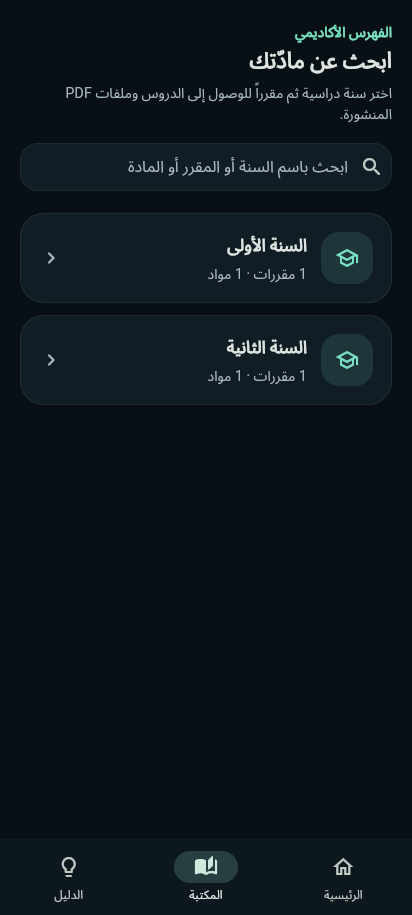
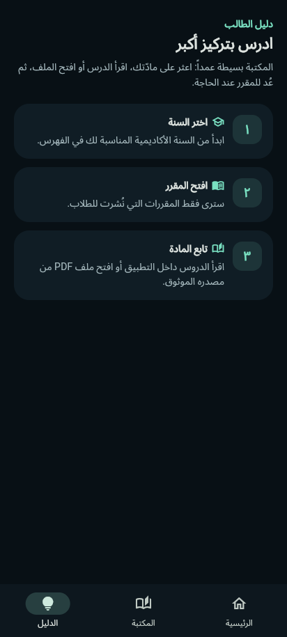

# Kunooze Library

> **The official Android reader for the Kunooze academic digital library.**

Kunooze Library is an Arabic, right-to-left Android application for students who access published academic cybersecurity material. Its academic path is deliberately simple: **Stage → Semester → Subject → Learning Material**. Students can read text lessons in the application, open owner-approved PDF resources, view active announcements, and search the catalogue without creating an account.

## Official Download

| Item | Link | Purpose |
|---|---|---|
| Latest Android APK | [Download Kunooze Library v1.0.0](https://github.com/9gkc/kunooze-library/releases/download/v1.0.0/kunooze-library-reader-v1.0.0.apk) | Install the student reader application. |
| Release page | [Open the v1.0.0 release](https://github.com/9gkc/kunooze-library/releases/tag/v1.0.0) | Review the release asset and its verification information. |
| Installation guide | [Read the installation guide](docs/INSTALLATION.md) | Follow the Android installation and update steps. |
| Verification record | [Read the verification record](docs/VERIFICATION.md) | Compare the APK version, checksum, and signing details. |

The official package is **`kunooze-library-reader-v1.0.0.apk`**. It is a signed production APK, not a debug or trial build. Its SHA-256 checksum is:

```text
25149dba1186c3d17dacd3961544eed47de15e07b6ba02447a83f51e8ac6fed6
```

## Student Experience

| Capability | What it means for students |
|---|---|
| Arabic RTL interface | The reader is designed for Arabic right-to-left reading. |
| Academic navigation | Browse four stages, their semesters, subjects, and published materials. |
| Text lessons | Read published text lessons inside the application. |
| Approved PDF resources | Open library-owner-approved Google Drive PDF links. |
| Active notices | View temporary announcements and timetable entries while they are active. |
| Search | Search by stage, semester, subject, or material title. |
| No student account | Browse published material without registration or sign-in. |

## Screenshots

The following authentic interface screenshots show the Arabic reader at a mobile-sized viewport. The app remains Arabic by design; the public documentation in this repository is English.

| Home | Academic catalogue | Student guide |
|---|---|---|
|  |  |  |

> The visible academic labels and counts are illustrative interface data. The live catalogue is published and maintained by the library owner. See the [screenshot notes](docs/SCREENSHOT_NOTES.md) for the privacy and scope statement.

## Installation and Updates

Android may require the student to allow installation from the browser or file manager that downloaded the APK. This permission should be enabled only for the trusted application used to download the official package. [1]

Version `1.0.0` uses the production signing certificate. It updates the preceding `v1.2` build normally because its Android version code is higher. A device that still holds the historically signed `v1.1` application must uninstall that older copy before installing this release. Removing the application does not delete library content, which is maintained remotely by the library owner.

## Public Distribution Scope

This repository is a **public binary-distribution repository**. It contains only the student reader APK, documentation, screenshots, and release verification information.

| Available here | Deliberately excluded |
|---|---|
| Reader APK release asset | Application source code |
| English installation and verification documentation | Owner publisher APK |
| Reader interface screenshots | Signing keys and Firebase configuration |
| Public checksum and version record | Owner credentials, student records, and unpublished materials |

Students should download only the Reader APK from the official release page and may share the unmodified official link with classmates. The owner publishing workflow remains private.

## References

[1] [Android Help — Download and install Android apps](https://support.google.com/android/answer/9450271)
