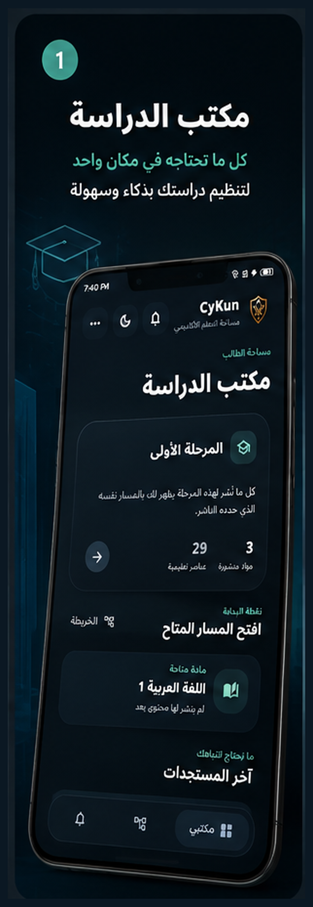
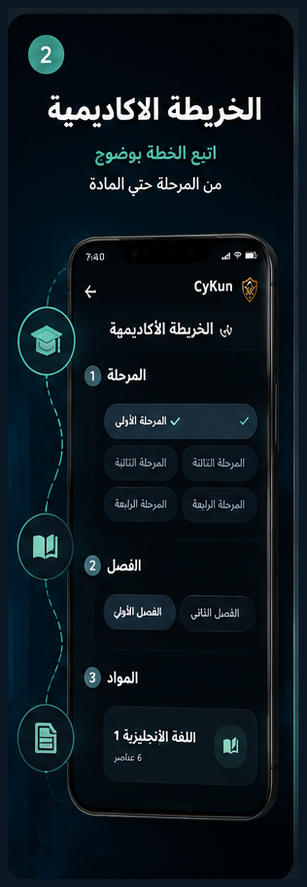
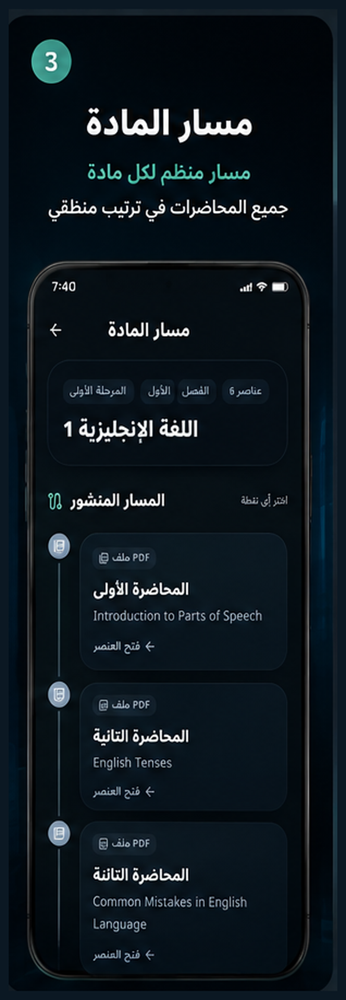
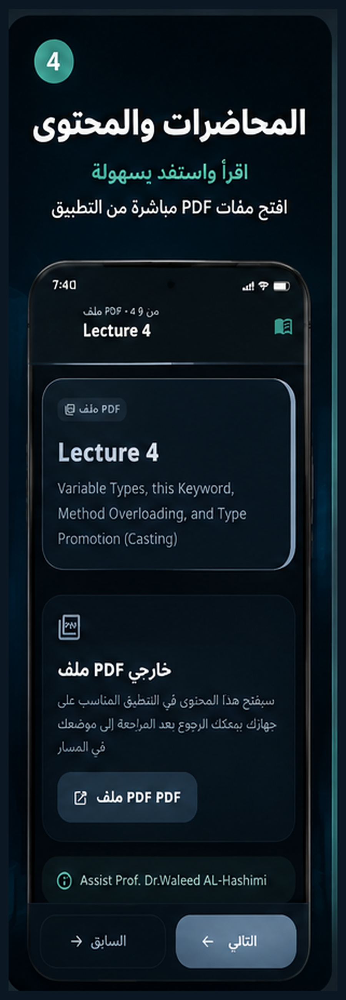

# CyKun

  

<strong>Cyber Kunooze — an Arabic academic library designed for cybersecurity students.</strong>

  
  
  

> **One focused study route:** academic stage → semester → subject → learning material.

CyKun Reader is the public Android companion for a structured academic library. It helps students move through published learning materials in Arabic without registration, management screens, or unnecessary distractions.

## Reader availability

| Resource | What it is | Link |
|---|---|---|
| Releases | The official location for a verified CyKun Reader APK when available | [View Releases](https://github.com/9gkc/cykun/releases) |
| Installation guide | Safe installation and update guidance | [Open the guide](docs/INSTALLATION.md) |
| Integrity guidance | How to validate the file supplied with a release | [Read verification guidance](docs/VERIFICATION.md) |

The next Reader download will be listed here only after it has completed the project's release verification process.

## A focused student experience

| Study Library | Academic Map |
|---|---|
|  |  |
| Start from a concise student dashboard and continue where you need to study. | Follow the academic structure from stage to semester and subject. |

| Subject Path | Lecture Reader |
|---|---|
|  |  |
| Keep learning materials in a clear, ordered sequence. | Read in-app material or open an approved PDF resource when available. |

## Built for academic flow

| Capability | Student benefit |
|---|---|
| Stage → semester → subject | Navigation follows the university study structure. |
| Ordered materials | Lectures, notes, and resources stay in a clear sequence. |
| Text and PDF support | Study short in-app material or access approved documents. |
| Updates centre | Find relevant announcements and newly available material. |
| Arabic RTL design | Read and navigate comfortably in Arabic. |
| No student account | Open the public library without creating an account. |

## Install with confidence

1. Open the [official Releases page](https://github.com/9gkc/cykun/releases) when a verified Reader APK is listed.
2. Open the downloaded file on Android and follow the installation prompt for that trusted download source.
3. Launch **CyKun** with an internet connection and start from the academic stage that applies to you.

For updates, download only from the official Releases page. Android can update an existing official installation when the package identity and signing certificate match.

## Official community

| Channel | Link |
|---|---|
| CyS4Ever | [t.me/cys4ever](https://t.me/cys4ever) |
| Developer profile | [linkedin.com/in/9gkc](https://www.linkedin.com/in/9gkc/) |

> CyKun never requests passwords, one-time verification codes, or sensitive account data through community channels.

## Public repository scope

This repository is intentionally limited to the **CyKun Reader** distribution experience: public release links, student documentation, and public showcase images. It does not contain management tools, unpublished academic material, credentials, configuration records, signing material, or implementation files.

## References

[1] [Android Help — Download and install Android apps](https://support.google.com/android/answer/9450271)  
[2] [Android Open Source Project — APK signing](https://source.android.com/docs/security/features/apksigning)
