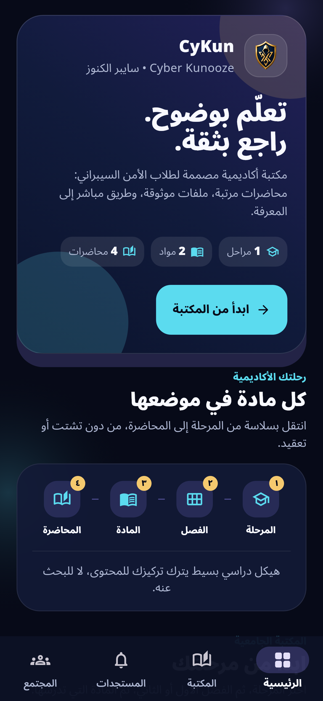
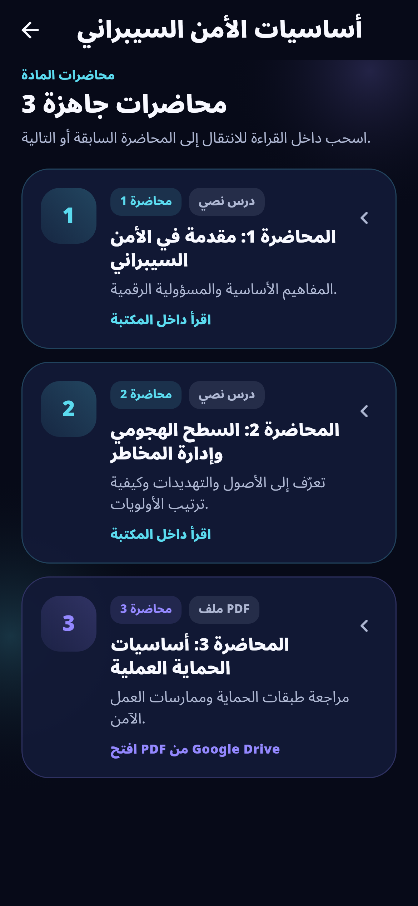
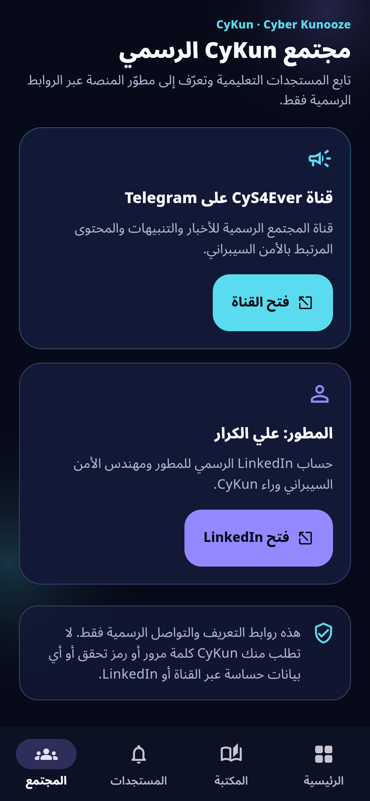

# CyKun

  

<strong>Cyber Kunooze for university cybersecurity students.</strong>

  
  
  
  

**CyKun** is the official Android Reader for a university cybersecurity library. It gives students one focused study route from an academic stage to a numbered lecture, without accounts, unnecessary menus, or a separate course-management layer.

> **Built for reading.** Content is published by the owner; students open the Reader, select their path, and study text lessons or approved PDF resources.

## Download the official Reader

| Resource | What it is | Link |
|---|---|---|
| Reader APK | Signed production APK for students | [Download CyKun v1.0.0](https://github.com/9gkc/cykun/releases/download/cykun-1.0.0-production-20260815/CyKun-Reader-v1.0.0-production.apk) |
| Release page | Official asset, notes, and checksum | [Open the production hotfix](https://github.com/9gkc/cykun/releases/tag/cykun-1.0.0-production-20260815) |
| Installation guide | Safe install and update steps | [Read the guide](docs/INSTALLATION.md) |
| Verification record | Package identity and SHA-256 value | [Verify the APK](docs/VERIFICATION.md) |

**Current asset:** `CyKun-Reader-v1.0.0-production.apk`
**SHA-256:** `e61b3353703b154adcacd658d3fc38f175bf2bf5b21b85788260e74f1ecd16a8`

## A focused academic route

CyKun deliberately keeps the academic structure simple and university-aligned.

| Step | Student action | Result |
|---:|---|---|
| 1 | Select a stage | Start from the correct academic year. |
| 2 | Select the first or second semester | See only that semester’s subjects. |
| 3 | Open a subject | Access its published learning materials. |
| 4 | Select a numbered lecture | Read an in-app lesson or open an approved PDF. |

## Real Reader screenshots

The gallery below contains authentic, locally rendered CyKun Reader screens. The product interface remains Arabic and right-to-left; this repository and its documentation are maintained in English.

| Home overview | Numbered lecture flow | Community and trust |
|---|---|---|
|  |  |  |
| A clear starting point with the complete study path. | Text and PDF materials are visibly distinguished and ordered. | Official links are available in the app, with an anti-phishing reminder. |

## What students get

| Capability | Why it matters |
|---|---|
| Stage → Semester → Subject → Lecture | The Reader follows the real academic hierarchy, without an invented course level. |
| Deterministic lecture order | Publisher-assigned lecture numbers keep materials in a predictable sequence. |
| Text lessons and PDF resources | Students can read inside the app or open an owner-approved PDF resource. |
| Announcements | The home area can surface active notices and temporary timetable information. |
| No student account | Students can browse published material without registration or sign-in. |
| Official community space | The in-app Community tab links only to the official CyS4Ever channel and developer profile. |

## Official community

| Presence | Purpose | Official link |
|---|---|---|
| CyS4Ever | Project updates, notices, and cybersecurity-related community content | [t.me/cys4ever](https://t.me/cys4ever) |
| Ali Alkarar | CyKun developer’s professional profile | [LinkedIn profile](https://www.linkedin.com/in/9gkc/) |

CyKun will never ask for a password, verification code, or sensitive account information through Telegram or LinkedIn. Use only the links shown above or the links inside the Reader.

## Versioning and updates

The public launch remains displayed as **v1.0.0**. Its Android version code is **12**, which is higher than the affected production package and allows Android to install this signed connectivity hotfix in place. The existing academic library remains stored remotely in Firebase; it is not recreated or deleted by an application update.

If Android does not offer an update, verify that the existing installation came from an official CyKun release before removing it. Published study material is managed remotely by the owner and is not bundled into the APK.

## Repository scope

This repository is a public distribution channel for the student Reader only.

| Included | Intentionally not included |
|---|---|
| Signed Reader APK and release notes | Reader or Publisher source code |
| Verification data and checksums | Publisher APK and owner workflow |
| Authentic Reader screenshots | Signing keys, Firebase files, credentials, and unpublished content |
| English student-facing documentation | Student records or private academic material |

For the full distribution policy, read [Distribution Scope](docs/DISTRIBUTION_SCOPE.md). For this update, read the [Production Hotfix release notes](docs/RELEASE_NOTES_20260815.md). The earlier [public-release notes](docs/RELEASE_NOTES_v1.0.0.md) remain available for history.

## References

[1] [Android Help — Download and install Android apps](https://support.google.com/android/answer/9450271)
[2] [Android Open Source Project — APK signing](https://source.android.com/docs/security/features/apksigning)
