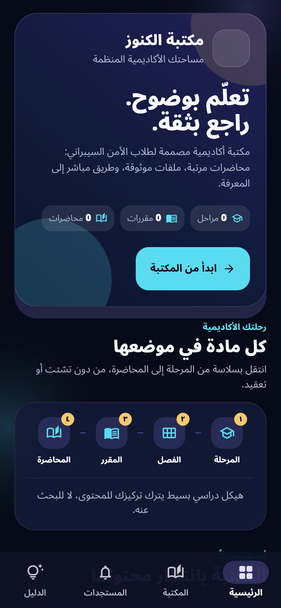

# Kunooze Library

> **The official Android Reader for the Kunooze academic digital library.**

**Kunooze Library** is an Arabic, right-to-left application for students who access university cybersecurity material. The Reader presents one calm, coherent route through the academic structure: **Stage → Semester → Subject → Numbered lecture**. It is designed for studying, not for managing content: students can browse without creating an account, read published lessons, open owner-approved PDF resources, follow lectures in sequence, and view active announcements or timetable notices.

## Official download

| Item | Link | Purpose |
|---|---|---|
| Latest Reader APK | [Download Kunooze Library v1.0.0](https://github.com/9gkc/kunooze-library/releases/download/v1.0.0/kunooze-library-reader-v1.0.0.apk) | Install the signed student Reader. |
| Release page | [Open the v1.0.0 release](https://github.com/9gkc/kunooze-library/releases/tag/v1.0.0) | Review the release asset and notes. |
| Installation guide | [Read the guide](docs/INSTALLATION.md) | Install or update safely on Android. |
| Verification record | [Verify the download](docs/VERIFICATION.md) | Compare version, signature, size, and checksum. |

The official package is **`kunooze-library-reader-v1.0.0.apk`**. It is a signed production APK, not a debug or trial build.

```text
SHA-256: f6bb3d24e7247f22672b462e8904fd2d55772e9c8c79852e480649afafeb1a12
```

## A redesigned Reader experience

| Capability | Student benefit |
|---|---|
| New Arabic visual system | A focused dark academic workspace with high-contrast typography, a new original mark, and clear reading hierarchy. |
| Home dashboard | See the academic route and current library totals at a glance. |
| Clear academic path | Move from the four stages to semester, subject, and lecture without losing context. |
| Ordered lecture flow | Read materials as numbered lectures and move to the previous or next lecture within the same subject. |
| Text and PDF learning | Read written lessons in the app or open owner-approved PDF resources. |
| Search and notices | Search published catalogue items and view active announcements or timetable entries. |
| No student account | Browse published content without registration or sign-in. |

## Interface preview

The following screenshot is an authentic golden render of the redesigned Reader home screen at a mobile viewport. It intentionally uses the application’s pending-data state, so the zero counts are **not** a representation of the live library catalogue.



## Installation and updates

The redesigned Reader is version **`1.0.0`** with Android version code **`7`**. It uses the same production package identity and signing certificate as the immediately preceding official production build (code `6`), so Android can update that build directly.

If Android reports that an older installation cannot be updated, it was signed with an earlier identity. In that specific one-time case, uninstall the old app and install the current official APK. Library materials remain remotely maintained by the owner and are not embedded in the app package.

## Public distribution scope

This is a **public binary-distribution repository** for students. It contains only the Reader APK, verification material, English documentation, and current Reader interface imagery.

| Available here | Deliberately excluded |
|---|---|
| Signed Reader APK | Application source code |
| Reader documentation and checksum | Publisher APK and owner workflow |
| Reader screenshot | Signing keys and Firebase configuration |
| Android installation guidance | Credentials, unpublished materials, and student records |

Students should download only the Reader APK from the official release page and may share the unmodified official link with classmates.

## References

[1] [Android Help — Download and install Android apps](https://support.google.com/android/answer/9450271)
